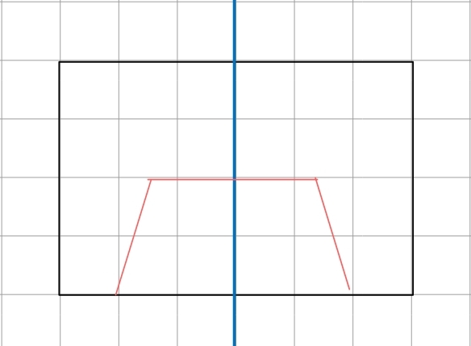

# 透视变换
透视变换在比赛中非常重要，我们在地图识别与微调时用到了透视变换。
## 1. 微调上的使用
在车抵达目标板附件时，摄像头检测到目标板后，可以通过透视变换确定图片距车的位置。这里需要强调下，我们使用的透视变换与四轮使用的有所不同，确切的说是图像坐标到世界坐标的一种变换。    
四轮的透视变换是为了使图像更易于判断元素，而在这里是为了得到确切的位置。所以，我们根本不需要对全图进行变换，只要对一个点进行变换。这样的计算量是非常小的。  
下面是透视变换的核心代码。
```python
#返回透视矩阵
#XY为世界坐标，UV为相机坐标
def cal_mtx(UV:np.array,XY:np.array)->np.array:
    A = []
    B =[]
    for i in range(4):
        a = [[UV[i][0],UV[i][1],1,0,0,0,-XY[i][0]*UV[i][0],-XY[i][0]*UV[i][1]],
             [0,0,0,UV[i][0],UV[i][1],1,-XY[i][1]*UV[i][0],-XY[i][1]*UV[i][1]]]
        B+= [[XY[i][0]],
             [XY[i][1]]]
        A+=a

    A = np.array(A)
    B = np.array(B)

    x= np.solve(A,B)

    H = [[x[0][0], x[1][0], x[2][0]],
         [x[3][0], x[4][0], x[5][0]],
         [x[6][0], x[7][0], 1]]

    return np.array(H)
```
其实只有短短几行，本质上是求解一个$3\times3$的矩阵$H$：
$$                  
  \begin{pmatrix} 
    H_{11} & H_{12} & H_{13}\\  
    H_{21} & H_{22} & H_{23}\\  
    H_{31} & H_{32} & 1\\
  \end{pmatrix}              
$$
共有8个未知数，所以求解这个矩阵需要有4个点。    
具体的推导这里就不一一赘述了，毕竟打公式比较累。有兴趣的可以搜下。  

得到这个矩阵后，将图像上的点化为其次坐标
$$
  \begin{pmatrix} 
    X^{'}\\
    Y^{'}\\
    S\\
  \end{pmatrix}   
  =
  \begin{pmatrix} 
    H_{11} & H_{12} & H_{13}\\  
    H_{21} & H_{22} & H_{23}\\  
    H_{31} & H_{32} & 1\\
  \end{pmatrix}   
  \begin{pmatrix} 
    U\\
    V\\
    1\\
  \end{pmatrix}   
$$
因为是其次坐标，所以要除与S后才能得到真实位置。

这里提供一个快速确定$H$的脚本（img2world.py），虽然不太严谨，但是按我们的经验，应付比赛是足够的。   
将一张A4纸按如下方式摆放  
    
红线画的是A4纸在摄像头的画面。注意A4纸的底部要与摄像头视野的底部对齐。中线与摄像头视野中线对其。这时候会得到一个矩阵$H$。   
我们暂且将车的左右方向定义为x轴，车头方向为y轴。这个时候你会发现，x轴方向的数据是较为准确的（可以用卷尺测试）。但y轴方向的误差应该是很大的。这是因为我们不知道摄像头视野底部离车的中心距离是多少。所以这里需要在y方向上添加一个平移常数。这里用手测一下就好了。
## 2. 识别地图
在识别地图中，透视变换特别的关键。这关乎到你的发车速度和识别准确率。    
如果没有进行透视变换，通常需要调整好后才能识别地图，而且识别准确率不太准确。但经过透视变换并取整后，其输出基本就是上位机生成的点位，不会有误差。  

不同于微调，识别地图的透视矩阵不是固定的，每一帧都需要计算一次，通过地图框的四个顶点确定。


